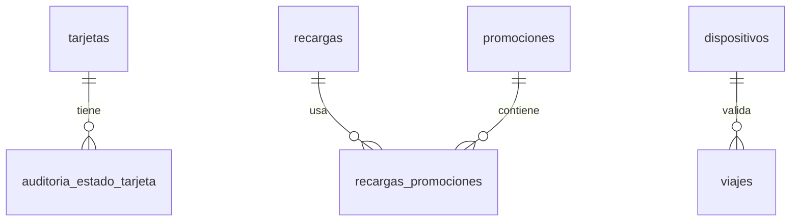

# Sistema Recargas y Viajes - Proyecto Final

## Funcionalidades implementadas

1. **Auditoría de estado de tarjetas**: Se registra cada cambio de estado (activa, bloqueada, etc.) en una tabla de auditoría.
2. **Promociones aplicadas en recargas**: Se permite registrar promociones y descuentos aplicados a las recargas.
3. **Registro de dispositivos de validación**: Se registra el dispositivo que valida cada viaje.
4. **Mejora adicional**: Propuesta de análisis por dispositivo (disponible en el script).

## Instrucciones de ejecución

1. Ejecutar `00_crear_tablas.sql`
2. Ejecutar `01_modificar_tablas.sql`
3. Ejecutar `02_insertar_datos.sql`
4. Ejecutar `03_consultas.sql`

## Diagramas Mermaid

## Tablas creadas/modificadas

| Tabla                      | Propósito                                      |
|---------------------------|-------------------------------------------------|
| auditoria_estado_tarjeta  | Auditoría de cambios de estado de tarjetas     |
| promociones               | Registro de promociones disponibles            |
| recargas_promociones      | Relación entre recargas y promociones          |
| dispositivos              | Registro de dispositivos de validación         |

## Consultas SQL

- Cambios de estado por mes
- Top 5 tarjetas con más cambios
- Recargas con promociones
- Total por tipo de promoción
- Promociones con "bonus"
- Viajes sin validación
- Validaciones por móviles en abril 2025
- Dispositivo con más validaciones
